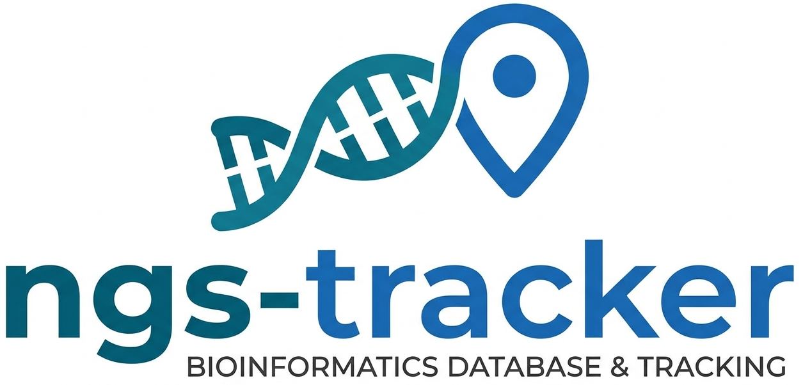

<p align="center">
  <picture>
    <source media="(prefers-color-scheme: dark)" srcset="logo/ngs-tracker_v3_text_dark.png">
    
  </picture>
</p>

A browser-based web app for tracking bioinformatics projects and analyses.
Data is organised as **Research Group → Researcher → Project → Workflow Run**,
with support for custom analysis scripts, file attachments, backup status,
and publication tracking.

---

## Features

- Hierarchical records: Research Groups → Researchers → Projects → Workflow Runs
- Attach Snakemake config files (YAML) — parsed and shown as a **collapsible tree** with expand/collapse all
- **Config diff** — side-by-side comparison of two Snakemake configs with colour-coded changes
- Upload a sample sheet (CSV) per run with a **confirmation step** to link named samples to the run
- **Sample-level tracking** — build a per-sample history across runs (raw → QC → alignment → variant calling)
- User-configurable workflow list with per-workflow GitHub URLs (any account or organisation)
- **Workflow run templates** — save a run's workflow + tag + description as a reusable template
- Track backup status per run (Local / RCS / RFS) with storage paths
- Run status tracking: Completed / Running / Pending / Failed
- **Tags on runs** — pick from a configurable default list; new tags are saved to the list automatically
- Clone a workflow run — copies all settings to a new run for quick re-use
- Attach processed data files to workflow runs — multiple files at once, with type and description
- Inline preview for image files (PNG, JPG, SVG, …) and PDFs without leaving the page
- Upload custom analysis scripts per project with output file attachments
- Mark projects as published with an optional publication URL
- **Export to CSV or Markdown** — download a summary of runs (statuses, backup locations, tags) for a project, researcher, or research group
- **Storage usage** — disk usage for uploaded files shown on project, researcher, and group detail pages
- Run notes and project descriptions rendered as **Markdown** (headings, lists, code, tables, links)
- Global search across groups, researchers, projects, runs, and scripts
- Soft-delete trash bin — deleted records can be restored or permanently removed
- **User system** — select who is currently working (no passwords required); tracked in change log
- **Change log** — plain-text audit trail at `~/.ngs-tracker/changes.log`, gzip-rotated at 100 MB
- **In-app log viewer** — browse and filter the change log by user, action type, or keyword
- Dashboard with live stats, a **status breakdown donut**, a **backup coverage panel**, a file-type pie chart, and a runs-per-month bar chart
- **GitHub link** in navbar showing the current release tag (or commit hash)
- Sortable tables on the Projects and Runs list pages
- Restart / Stop server buttons in the navbar
- Settings (database path, file storage path) persisted to `~/.ngs-tracker/`

---

## Requirements

- [Conda](https://docs.conda.io/) (Miniconda or Anaconda)
- Python 3.11

---

## Installation

```bash
git clone https://github.com/niekwit/ngs-tracker.git
cd ngs-tracker

# Create the conda environment
conda create -n ngs-tracker python=3.11 -y
conda activate ngs-tracker
pip install -r requirements.txt
```

---

## Running

```bash
./run.sh
```

Then open **http://127.0.0.1:5000** in your browser.

On first launch you will be taken to the **Settings** page to configure:

| Setting | Description |
|---|---|
| **File storage path** | Directory where uploaded files are saved |
| **Database path** | Full path to the SQLite database file (e.g. `/data/ngs.db`) |

Both settings are saved to `~/.ngs-tracker/settings.json` and survive re-clones or moves of the repo directory.

### Optional environment variables

| Variable | Default | Description |
|---|---|---|
| `NGS_PORT` | `5000` | Port to listen on |
| `NGS_HOST` | `127.0.0.1` | Host to bind to — set to `0.0.0.0` to expose on the local network |

```bash
NGS_PORT=8080 ./run.sh
```

---

## Data model

```
Research Group
└── Researcher
    └── Project
        ├── Workflow Run
        │   ├── Sample Sheet (CSV, displayed as table)
        │   ├── Attached Files  (config, QC, results, sample info, other)
        │   └── Linked Samples  (confirmed from sample sheet)
        ├── Sample  (per-sample run history across all runs)
        └── Custom Analysis Script
            └── Script Output Files
```

### Workflow Runs

- Select a workflow from the configurable list; release tags are fetched live from GitHub
- Optionally **load a saved template** to pre-fill workflow, tag, and description for recurring run types
- Upload a Snakemake YAML config — settings are displayed as a **collapsible tree** (top-level keys open by default); a "Collapse/Expand all" button controls the whole tree
- Upload a sample sheet (CSV) — rendered as a full scrollable table with sticky header; after upload a confirmation step lets you choose which CSV column contains sample names, rename entries, and link them to the run
- Attach multiple files at once — choose a type (Snakemake Config, Sample Info, QC, Results, Other) and optional description for the whole batch
- Image files (PNG, JPG, SVG, WEBP, …) and PDFs can be previewed inline without downloading
- Track run status: **Completed**, **Running**, **Pending**, or **Failed**
- **Tags** — tick any combination from the default list; type a new tag to add it to the defaults automatically; tags link to a filtered runs list
- Clone a run to copy all its settings into a new run (status resets to Pending)
- **Save as Template** — store the run's workflow + tag + description for reuse on future runs
- Record backup locations (Local, RCS, RFS) with storage paths
- Run notes support **Markdown** formatting (headings, lists, code blocks, links, tables)

### Config diff

When a run has a parsed Snakemake config, a **Compare Config** button appears on the detail page. Select any other run that also has a config, and the comparison page shows a three-column table (key · value A · value B) with colour-coded rows:

| Colour | Meaning |
|---|---|
| Yellow | Value differs between the two runs |
| Red | Key only present in run A (removed) |
| Green | Key only present in run B (added) |
| Plain | Identical in both runs |

Nested config keys are flattened to dot-notation (e.g. `params.threads`). A **Hide unchanged** toggle collapses identical rows so only differences are visible.

### Sample tracking

After confirming samples from a run's sample sheet, each named sample gets its own record within the project. The sample detail page shows a full run history — every workflow run that included that sample — with dates, statuses, and tags. This makes it easy to trace a sample from raw data through QC, alignment, and variant calling.

- Samples are linked per-project; the same sample name in two different runs is recognised as the same sample
- Rename or delete samples from their detail page
- Re-confirm samples at any time (e.g. after re-uploading a sample sheet) without duplicating records
- All project samples are shown as clickable badges on the project detail page

### Export

An **Export** dropdown on every project, researcher, and group detail page generates a file containing all workflow runs and their key fields (date, workflow, status, backup locations, tags, notes, sample count, file count).

| Format | Contents |
|---|---|
| **CSV** | Flat table — one row per run, importable into Excel or R |
| **Markdown** | Metadata header block followed by a formatted table — ready to paste into a lab notebook, grant report, or email to a PI |

### Workflow management

Workflows are stored in `~/.ngs-tracker/workflows.yaml` and created from a built-in default list on first run. Each entry has a **name** and the full **GitHub URL** of the repository:

```yaml
- name: rna-seq-star-deseq2
  url: https://github.com/niekwit/rna-seq-star-deseq2
- name: my-custom-workflow
  url: https://github.com/some-other-org/my-custom-workflow
```

Manage workflows via the **Workflows** page in the sidebar (add / remove) or by editing the YAML file directly. Any GitHub account or organisation is supported.

### Run templates

Save any workflow run as a named template (stores workflow name, release tag, and description). Templates are listed on the **Workflows** page and can be loaded from the new-run form to pre-fill those fields. Useful for recurring run types (e.g. "Standard RNA-seq v2.1", "ChIP-seq pilot").

Templates are stored in `~/.ngs-tracker/run_templates.json`.

### Custom Analysis Scripts

Supported languages (auto-detected from extension): Python, R, Shell, Bash, Perl, MATLAB, Julia, Jupyter

---

## Users

The **Settings** page lets you add named users and switch between them — no passwords required. The active user is shown in the navbar and recorded in every change log entry. Users are stored in `~/.ngs-tracker/settings.json`.

---

## Change log

Every create, update, trash, restore, and delete action is appended to `~/.ngs-tracker/changes.log` in plain text:

```
2025-06-12 14:03:22 | CREATE   | WorkflowRun         | id=42     | user=Niek                 | rna-seq-star-deseq2 (project: KO screen)
```

When the file exceeds 100 MB it is gzip-archived (e.g. `changes.20250612_140322.log.gz`) and a new file is started.

Browse and filter the log directly in the browser via **Change Log** in the sidebar. Filters: user, action type (CREATE / UPDATE / TRASH / DELETE / RESTORE), and free-text search. Results are paginated at 100 entries per page, most recent first.

---

## Dashboard

The dashboard shows:

- **Stats row** — counts for Groups, Researchers, Projects, Runs, and Files (click Files to see a pie chart broken down by file type)
- **Groups panel** — quick overview of all research groups with researcher and project counts
- **Recent runs** — the 8 most recently added workflow runs
- **Status breakdown** — donut chart of run counts by status (Completed / Running / Pending / Failed)
- **Backup coverage** — percentage of runs with at least one backup, a progress bar, and per-location counts (Local / RCS / RFS)
- **Runs per month** — bar chart of workflow run activity over the last 12 calendar months

---

## Search

A search box in the navbar searches across all record types simultaneously — Research Groups, Researchers, Projects, Workflow Runs, and Scripts. Results are grouped by type and link directly to each record.

---

## Trash / recycle bin

Clicking **Delete** on any record moves it to the trash rather than permanently removing it.

- **Restore** — returns the record to its normal location
- **Delete** — permanently removes the record and all its associated files
- **Empty Trash** — permanently removes everything in the trash at once

Access the trash via the **Trash** link in the sidebar.

---

## Running at startup (Fedora / Ubuntu)

A systemd user service starts NGS Tracker automatically at login — or at boot if lingering is enabled (no login required).

**1. Find the full path to conda**

```bash
which conda   # e.g. /home/niek/miniforge3/condabin/conda
```

Systemd user services do not source `.bashrc`, so `conda` will not be in `PATH` unless you use the absolute path.

**2. Create the service file**

Create `~/.config/systemd/user/ngs-tracker.service` (substitute your conda path and repo location):

```ini
[Unit]
Description=NGS Tracker
After=network.target

[Service]
WorkingDirectory=/path/to/ngs-tracker
ExecStart=/home/you/miniforge3/condabin/conda run -n ngs-tracker python app.py
Restart=on-failure

[Install]
WantedBy=default.target
```

**3. Enable and start**

```bash
systemctl --user daemon-reload
systemctl --user enable --now ngs-tracker
```

**4. Start at boot without a login session**

```bash
loginctl enable-linger $USER
```

**Useful commands**

```bash
systemctl --user status ngs-tracker     # check status
systemctl --user restart ngs-tracker    # restart manually
journalctl --user -u ngs-tracker -f     # live logs
```

> **Memory:** NGS Tracker uses roughly 40–80 MB RAM at idle — comparable to a terminal window.

---

## Updating

```bash
git pull
# Dependencies rarely change, but re-run if requirements.txt was updated:
pip install -r requirements.txt
```

Database schema migrations are applied automatically on startup — no manual steps needed.
