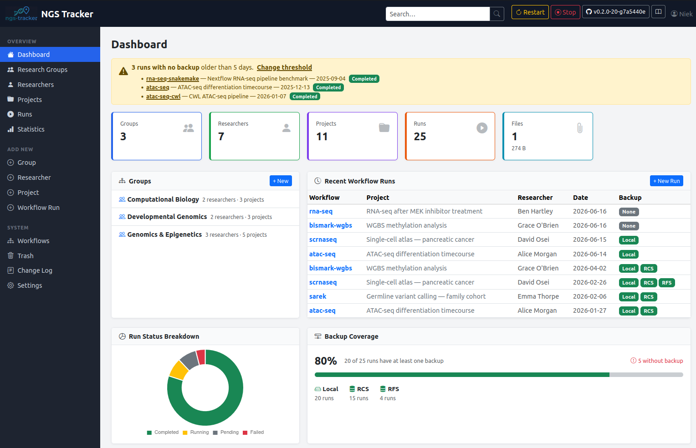

# NGS Tracker

A browser-based web app for tracking bioinformatics projects and workflow analyses.
Data is organised as **Research Group → Researcher → Project → Workflow Run**, with support
for sample tracking, custom scripts, file attachments, backup status, and publication tracking.



---

## Features at a glance

**Project hierarchy**
: Research Groups → Researchers → Projects → Workflow Runs — each level with its own detail page, disk usage summary, and export.

**Multi-system workflow support**
: Register workflows from Snakemake, Nextflow, CWL, or Other systems. Each run carries a coloured system badge throughout the UI.

**Config viewer & diff**
: Upload YAML/JSON config files — they are parsed and rendered as a collapsible tree. Compare two run configs side-by-side with colour-coded differences.

**Sample tracking**
: Upload a CSV sample sheet per run. A confirmation step links named samples to the run and builds a cross-run history for each sample.

**Backup tracking**
: Per-run backup status across user-defined locations, each tagged as local or remote.

**Run templates**
: Save a run as a named template (workflow + tag + description) and load it when creating future runs.

**Export**
: Download project, researcher, or group summaries as CSV or Markdown — ready for grant reports or PI emails. Backup entries include the storage path.

**Slack notifications**
: Automatic messages to a Slack channel when runs are registered or their status changes, and when snapshots succeed or fail. A manual **Notify** button on each run opens a compose page to review and send a custom message to the researcher's group channel, with a `@mention` if their Slack member ID is set.

**Shared storage path**
: Each workflow run and custom script can record the cloud or network path where data is shared with the researcher — separate from backup locations.

**Dark mode**
: A toggle in the page header switches between light and dark themes. The preference is remembered across sessions.

**Dashboard**
: Live stats (including total file size), status breakdown donut (click any slice to filter runs), backup coverage panel with a modal listing all unprotected runs, and a file-type pie chart.

**Statistics**
: Cross-run charts: runs per month, executions per workflow, average runtime, runtime trend per workflow, published projects per group, and publications per journal (clickable to filter the runs list).

**Full-text search**
: The navbar search box searches across groups, researchers, projects, run names/descriptions/tags, and run notes — with highlighted excerpts showing where in the notes a match was found.

**Audit log**
: Every action is written to a plain-text change log with user attribution, filterable in the browser.

**REST API**
: A JSON API at `/api/` lets you register and update workflow runs from Snakemake `onsuccess` blocks, Nextflow `workflow.onComplete` handlers, SLURM epilogues, or any script. Authentication via a per-installation API key shown in Settings.

---

```{toctree}
:maxdepth: 2
:hidden:
:caption: Getting started

installation
```

```{toctree}
:maxdepth: 2
:hidden:
:caption: Using NGS Tracker

data-model
runs
workflows
settings
searching
audit-log
dashboard
stats
```

```{toctree}
:maxdepth: 2
:hidden:
:caption: Automation

api
```

```{toctree}
:maxdepth: 1
:hidden:
:caption: Deployment

startup
updating
```
