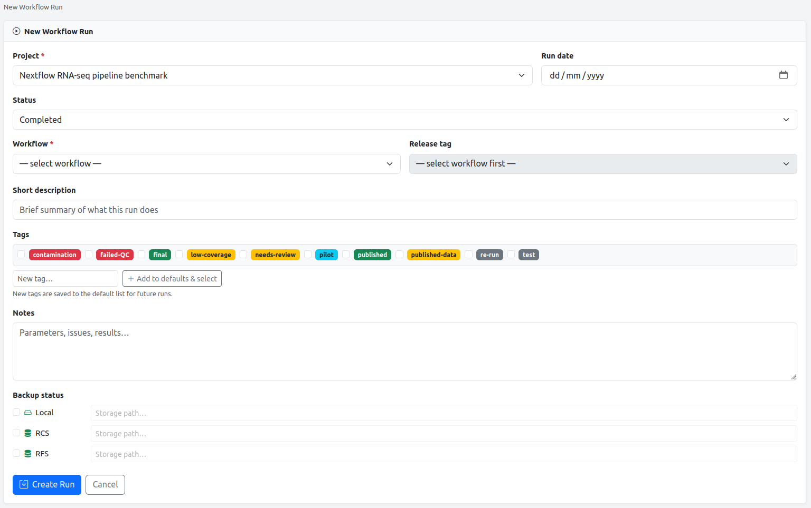

# Workflow runs

A Workflow Run is the core record in NGS Tracker. It belongs to a project and captures everything about a single pipeline execution.

## Creating a run

When creating or editing a run you can fill in:

| Field             | Notes                                               |
| ----------------- | --------------------------------------------------- |
| **Project**       | Required. Cannot be changed after creation.         |
| **Run date**      | Defaults to today.                                  |
| **Status**        | Completed / Running / Pending / Failed              |
| **Workflow**      | Selected from the registered workflow list          |
| **Release tag**   | Fetched live from GitHub after a workflow is chosen |
| **Description**   | Short free-text summary                             |
| **Tags**          | Tick from the default list; add new tags inline     |
| **Notes**                | Long-form Markdown text                                    |
| **Backup status**        | Per-location checkboxes with optional storage path         |
| **Shared storage path**  | Cloud/network path shared with the researcher (optional)   |



## Duplicate detection

NGS Tracker checks whether another non-trashed run already exists with the same **workflow name**, **project**, and **calendar date**. If one is found:

- **Run detail page** — a persistent yellow warning banner appears every time the run is viewed, with links to all duplicate runs. The banner remains visible until one of the duplicates is deleted.
- **Web form (at creation)** — the same warning also fires as a flash message immediately after a new duplicate run is saved.
- **REST API** — the create response body includes `"duplicate_warning": true` and `"duplicate_of": [<id>, ...]` alongside the normal 201 payload.

The check is date-based (same day), not time-based, so re-running a pipeline later the same day is still flagged. Delete whichever run was submitted accidentally.

## Workflow system badge

When a workflow is selected in the form, a coloured pill badge immediately shows the workflow system — Snakemake (green), Nextflow (orange), CWL (blue), or Other (grey). The badge also appears on the run detail page next to the workflow name.

## Run templates

Any run can be saved as a named template (**Save as Template** button on the detail page). Templates store the workflow name, release tag, and description. They appear in a picker at the top of the new-run form.

Templates are stored in `~/.ngs-tracker/run_templates.json` and managed via the **Workflows** page.

## Cloning a run

The **Clone** button on a run detail page copies all settings (workflow, tag, description, tags, notes, backup locations) into a new run with status set to **Pending**. Use this for re-running a pipeline with the same parameters.

## Config files

Upload a YAML or JSON config/params file using the **Config** file type. If the file parses as a dictionary, it is displayed as a **collapsible tree** on the run detail page:

- Top-level keys are expanded by default
- Nested keys are shown inside `<details>` elements — click to expand
- A **Collapse all / Expand all** button controls the entire tree at once
- The raw file is always available for download

Files that do not parse as YAML/JSON (e.g. a Nextflow Groovy `.config` file) are stored and available for download but no tree is shown.

### Config diff

When a run has a parsed config, a **Compare Config** button appears on the detail page. Select any other run that also has a parsed config and the comparison page shows a three-column table:

| Colour | Meaning                            |
| ------ | ---------------------------------- |
| Yellow | Value changed between the two runs |
| Red    | Key only in run A (removed)        |
| Green  | Key only in run B (added)          |
| Plain  | Identical in both                  |

Nested keys are flattened to dot-notation (e.g. `params.threads`). A **Hide unchanged** toggle collapses identical rows.

## Sample sheets

Upload a CSV or TSV sample sheet via the **Upload CSV** button on the run detail page. After upload:

1. You are taken to a confirmation page
2. Choose which column contains the sample names
3. Rename entries if needed
4. Click **Confirm** to link the samples to the run and create sample records in the project

The sample sheet is rendered as a full scrollable table with a sticky header on the run detail page.

## File attachments

Multiple files can be uploaded at once. Each batch is assigned a **type** and an optional description:

| Type          | Typical contents                                        |
| ------------- | ------------------------------------------------------- |
| Config        | YAML/JSON pipeline config or params file                |
| Mapping Rates | CSV with per-sample alignment mapping rates (see below) |
| Sample Info   | Metadata spreadsheets                                   |
| QC            | MultiQC HTML, FastQC reports                            |
| Results       | Count matrices, VCF files, peak calls                   |
| Other         | Anything else                                           |

Images (PNG, JPG, SVG, WEBP, …) and PDFs open in an **inline lightbox** — no download required.

### Mapping rates

Upload a CSV file with exactly two columns — `sample` and `mapping_rate` — to get an interactive bar chart directly on the run detail page:

```csv
sample,mapping_rate
Sample_A,87.3
Sample_B,82.1
Sample_C,45.6
```

NGS Tracker renders a **bar chart** for each mapping rates file attached to the run. A red dashed line marks the workflow's mapping rate cutoff:

- If all samples meet the cutoff, a green banner confirms this.
- If any samples fall below it, an orange warning banner lists the failing sample names.

The cutoff threshold is configured **per workflow** on the [Workflows](workflows.md) page (default: 60 %). Multiple mapping rates files can be attached to the same run — each produces its own chart.

## Tags

Tags are free-text labels shared across all runs. A default list is maintained in Settings. When creating or editing a run:

- Tick tags from the default list
- Type a new tag to add it to the defaults automatically and select it
- Tags appear as clickable badges on the run detail page and link to a filtered view of all runs with that tag

## Shared storage path

The **Shared storage path** field stores the cloud or network location where results are made available to the researcher — for example a OneDrive folder, a shared network drive, or an HPC project directory. It is separate from the [backup status](#backup-status) fields, which record internal copies for data safety.

The path is shown on the run detail page in the Backup Status card and is included in the [Slack notification](#slack-notification) message if set.

## Backup status

Each run records which backup locations hold a copy, along with an optional storage path for each. Locations are configured in [Settings](settings.md).

The run detail page shows a check or cross for every configured location. Locations that have been removed from the config but were recorded on historical runs appear with a `(removed)` label — the data is preserved.

## Notes

The notes field supports full **Markdown** formatting — headings, bullet lists, numbered lists, code blocks (fenced and inline), bold/italic, links, blockquotes, and tables. Notes are rendered in the browser when viewing the run.

## Export

Every project, researcher, and group detail page has an **Export** dropdown. The generated file covers all workflow runs with these columns: Group, Researcher, Project, Run Date, Workflow, Tag, Status, Backup, Tags, Notes, Samples, Files.

| Format       | Use case                                                  |
| ------------ | --------------------------------------------------------- |
| **CSV**      | Import into Excel, R, or Python for further analysis      |
| **Markdown** | Paste into a lab notebook, grant report, or email to a PI |

## Filtering by status

The runs list can be filtered to show only runs with a specific status. Click any segment of the **Status breakdown** donut on the [Dashboard](dashboard.md), or navigate directly:

```
/runs?status=completed
/runs?status=failed
/runs?status=running
/runs?status=pending
```

A dismissible banner at the top of the list shows the active status filter. Click **clear filter** to return to the full list.

You can combine a status filter with a tag filter:

```
/runs?status=failed&tag=RNA-seq
```

## Filtering by date range

A **Date** row above the tag filter lets you narrow the list to runs within a specific period:

1. Enter a **from** date, a **to** date, or both, using the date pickers.
2. Click **Apply**.
3. A blue banner confirms the active date range. Click **clear filter** in the banner or **Clear dates** next to the pickers to remove it.

Date filters can be combined freely with status and tag filters. They are also preserved across sort column changes and pagination. You can link directly to a date-filtered view:

```
/runs?date_from=2025-01-01&date_to=2025-06-30
/runs?date_from=2025-06-01                     # from date only
/runs?date_to=2025-12-31&status=completed      # combined with status
```

The same `date_from` / `date_to` parameters are supported by the [REST API](api.md) `GET /api/runs` endpoint.

## Batch operations

Select multiple runs on the runs list page and apply an action to all of them at once.

**How to use:**

1. Tick the checkbox on the left of one or more rows. A batch action bar appears above the table.
2. The bar shows how many runs are selected and offers three actions:

| Action          | How                                                                                       |
| --------------- | ----------------------------------------------------------------------------------------- |
| **Set Status**  | Choose a status from the dropdown and click **Set Status**                                |
| **Add Tag**     | Type or select a tag and click **Add Tag**                                                |
| **Mark Backup** | Choose a backup location and click **Mark Backup**                                        |
| **Remove Tags** | Click **Remove Tags** and confirm in the dialog — clears every tag from each selected run |

3. Click **Deselect all** to clear the selection without taking an action.

**Notes:**

- The **Select all** checkbox in the table header selects every run on the current page.
- **Add Tag** only adds the tag to runs that do not already have it; it also saves the tag to the global default list.
- **Mark Backup** records the location without a path. To add a path, edit the run individually.
- All batch actions are written to the [audit log](audit-log.md).
- Filters and sort order are preserved after a batch action.

## Slack notification

Once [Slack is configured](settings.md#slack-notifications), a green **Notify** button appears on every run detail page. Clicking it opens a compose page where you can review and edit a message before sending — useful for cases where the data needs to be checked before sharing with a researcher.

### Compose page

The compose page pre-fills a message in [Slack mrkdwn](https://api.slack.com/reference/surfaces/formatting) format containing:

- A @mention of the researcher (using their Slack user ID if set — see [Researcher Slack user ID](settings.md#researcher-slack-user-id))
- Project name, workflow name, and run ID
- Run status with an emoji indicator
- Workflow version/tag (if set)
- Short description (if set)
- Sample names from the parsed config file (if available)
- Shared storage path (if set)

All of this text is fully editable before sending.

### Channel name

The destination channel is automatically derived from the **research group name** — spaces become hyphens and the name is lowercased:

| Research group | Derived channel |
|---|---|
| James Nathan | `#james-nathan` |
| Nathan Lab (Cambridge) | `#nathan-lab-cambridge` |
| RNA-seq Core | `#rna-seq-core` |

The derived channel is shown in an editable field on the compose page, so you can correct it if the actual Slack channel name differs.

### Private channels

If the target channel is private, invite the bot from within Slack before sending:

```
/invite @NGS Tracker
```

### Audit log

Every message sent is written to the [audit log](audit-log.md) as a `CREATE SlackMessage` entry recording the channel name and run.

## Pagination

The runs list shows **50 runs per page**. When there are more than 50 runs, a page count (`Showing X–Y of Z`) appears below the page heading and Bootstrap pagination controls appear below the table.

The current page, sort column, sort direction, tag filter, and status filter are all preserved in pagination links — navigating between pages does not reset your filters or sort order.

Pagination is also supported via the [REST API](api.md) when querying `/api/runs`.
